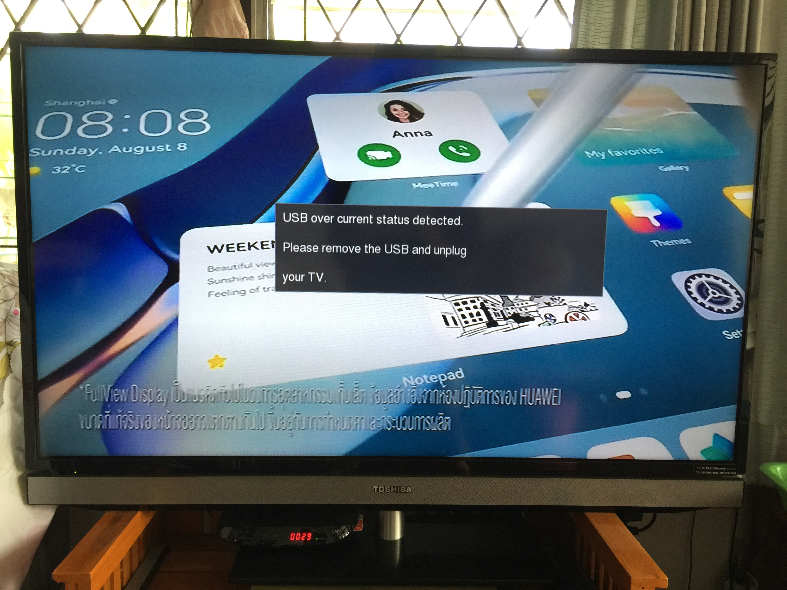
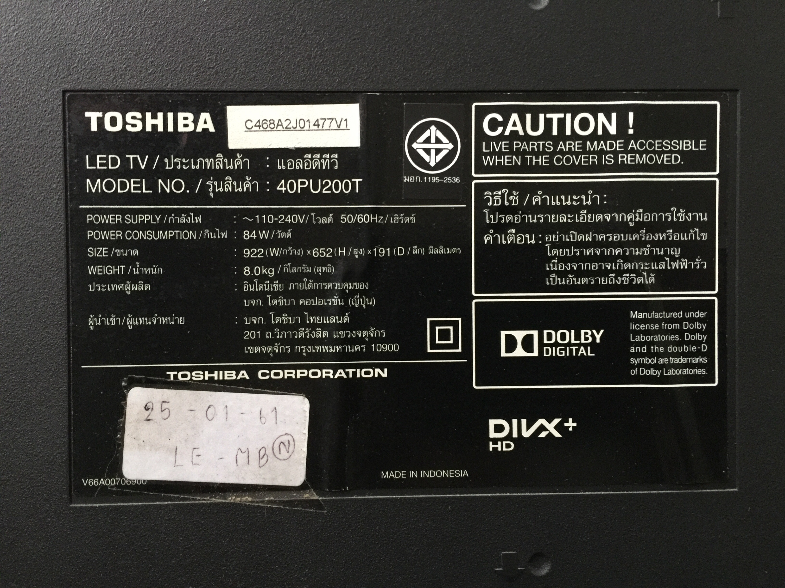
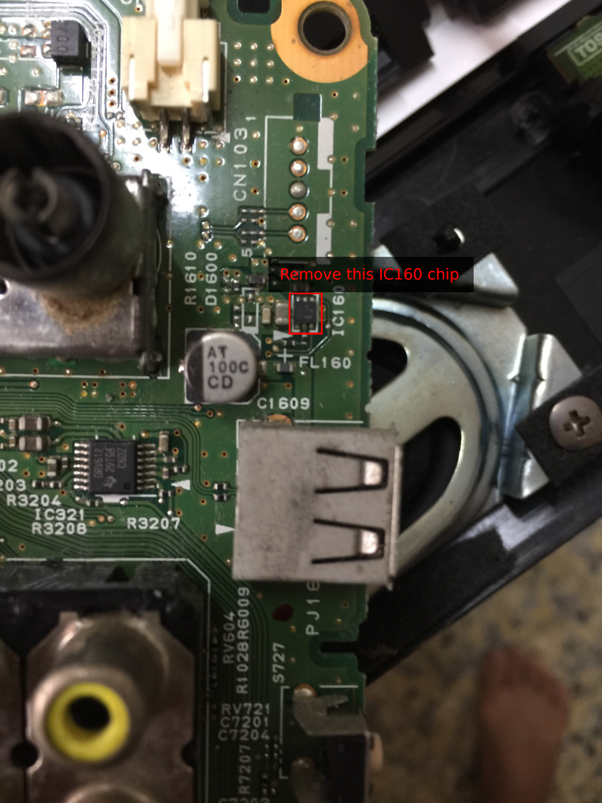
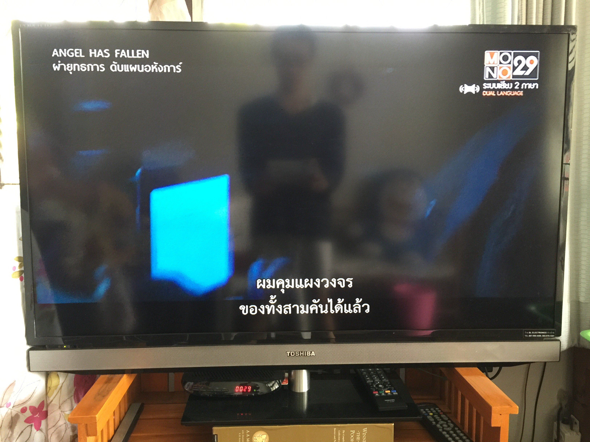

## Fix Toshiba TV - USB over current status detected

Around early Dec 2021, our Toshiba TV started misbehaving like so:

Thanks to some kind souls who faced the same problem and uploaded [some](https://youtu.be/tRDoEotTzOo?t=293)
[videos](https://youtu.be/Nh44LFsYmxM?t=145) on how to fix them, we managed to
fix ours too.

We have a Toshiba 40PU200T model. The trailing 'T' presumably means
local to Thailand. Some online forums mention that it is common to very
many LED models.

The fix is rather simple. Open up the board behind the TV, remove the
`IC160` chip and you are good to go. The `IC160` chip is really tiny,
around 5mm. We used a solder to heat the chip and scraped it out with a
pair of pliers.

In our haste to see if the problem was fixed, we forgot to take a
picture of the board after removing the chip  So all that we can share
is a picture of the TV after it was all reassembled:

Thanks for reading.

