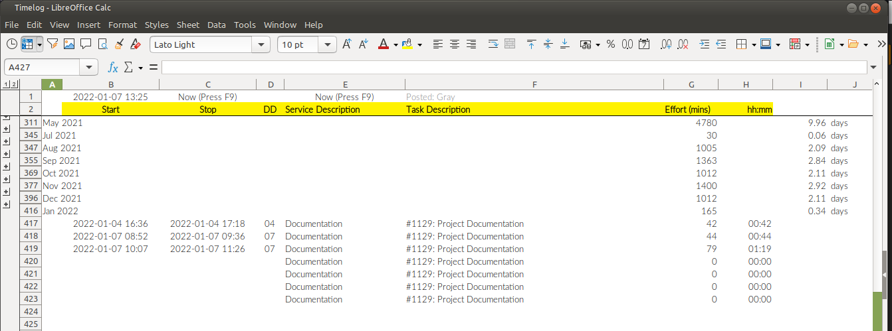

# LibreCalc Timesheet Macro
*<small>Fri, 07 Jan 2022 / [Home](README.md)</small>*

To track effort spent on work, both paid and unpaidd, I've been keeping
a simple timesheet.



And one of the more onerous steps is to enter the current date and time
into the task-start and task-stop columns.

For several years now, I've been diligently entering the date and time
until a few months ago when the idea of writing a macro popped up.

With a macro, it's now literally just a press of the button.


Below is the macro used, scraped together from bits of code from various
corners of the internet.

----
### The UpdDttm Macro
```
REM  *****  BASIC  *****

sub UpdDttm
rem ----------------------------------------------------------------------
rem define variables
dim document   as object
dim dispatcher as object
rem ----------------------------------------------------------------------
rem get access to the document
document   = ThisComponent.CurrentController.Frame
dispatcher = createUnoService("com.sun.star.frame.DispatchHelper")

rem ----------------------------------------------------------------------
oCell  = ThisComponent.getCurrentSelection()
addr = oCell.AbsoluteName

rem ----------------------------------------------------------------------
dim args1(0) as new com.sun.star.beans.PropertyValue
args1(0).Name = "ToPoint"
args1(0).Value = "$B$1"

dispatcher.executeDispatch(document, ".uno:GoToCell", "", 0, args1())
dispatcher.executeDispatch(document, ".uno:Calculate", "", 0, Array())
dispatcher.executeDispatch(document, ".uno:Copy", "", 0, Array())

rem ----------------------------------------------------------------------
dim args4(0) as new com.sun.star.beans.PropertyValue
args4(0).Name = "ToPoint"
args4(0).Value = addr

dispatcher.executeDispatch(document, ".uno:GoToCell", "", 0, args4())

rem ----------------------------------------------------------------------
dim args5(5) as new com.sun.star.beans.PropertyValue
args5(0).Name = "Flags"
args5(0).Value = "SVD"
args5(1).Name = "FormulaCommand"
args5(1).Value = 0
args5(2).Name = "SkipEmptyCells"
args5(2).Value = false
args5(3).Name = "Transpose"
args5(3).Value = false
args5(4).Name = "AsLink"
args5(4).Value = false
args5(5).Name = "MoveMode"
args5(5).Value = 4

dispatcher.executeDispatch(document, ".uno:InsertContents", "", 0, args5())

end sub
```

As it turns out, with LibreOffice 7.x (or maybe even earlier), you can
enter the current date and time simply by pressing `Ctrl-Shift-;`. That
is certainly useful but I needed the values to be formatted as text with
just `YYYY-MM-DD hh:mm` as other formulas in the worksheet relies on
that format. So, macro is still useful.

