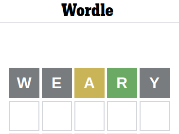

# Wordle Program

A quick program to solve [Wordle](https://www.nytimes.com/games/wordle/index.html).

----

Heard about how New York Times purchased Wordle and decided to find out
what it is all about.

On reaching the page, an explaination is given on how to play the game.


So, tried `WEARY` as suggested in the examples and was pleasantly
surprised.



Then tried `SPILT`:


And `CHUNK`:


At which point I decided to write a quick program to help solve the
problem giving the answer:


The program is below. It's not a general solver yet. And still needs one
to look at the generated permutations to figure out the right answer.
But it's probably not difficult to make a general solver. Find five
words that cover the entire alphabet. That'll give us the five letters
that make up the word. Then use the program to generate the
permutations, filter out the invalid ones and then guess the correct
word.

----
```
# wordle.pl
use strict; use warnings; use utf8; use 5.10.0;

# Guesses:
# WEARY SPILT CHUNK

my @letters = qw/A R L T U/;

my $c = 0;
for (my $i = 0; $i < 5; $i++) {
    for (my $j = 0; $j < 5; $j++) {
        next if $i == $j;
        for (my $k = 0; $k < 5; $k++) {
            next if $i == $k;
            next if $j == $k;
            for (my $l = 0; $l < 5; $l++) {
                next if $i == $l;
                next if $j == $l;
                next if $k == $l;
                for (my $m = 0; $m < 5; $m++) {
                    next if $i == $m;
                    next if $j == $m;
                    next if $k == $m;
                    next if $l == $m;

                    # Filter
                    next unless $letters[$l] eq 'R';
                    next if $letters[$k] eq 'A';
                    next if $letters[$k] eq 'U';
                    next if $letters[$m] eq 'T';

                    say join '', $letters[$i], $letters[$j], $letters[$k], $letters[$l], $letters[$m];
                    $c++;
                }
            }
        }
    }
}

say "Total: $c";
```

